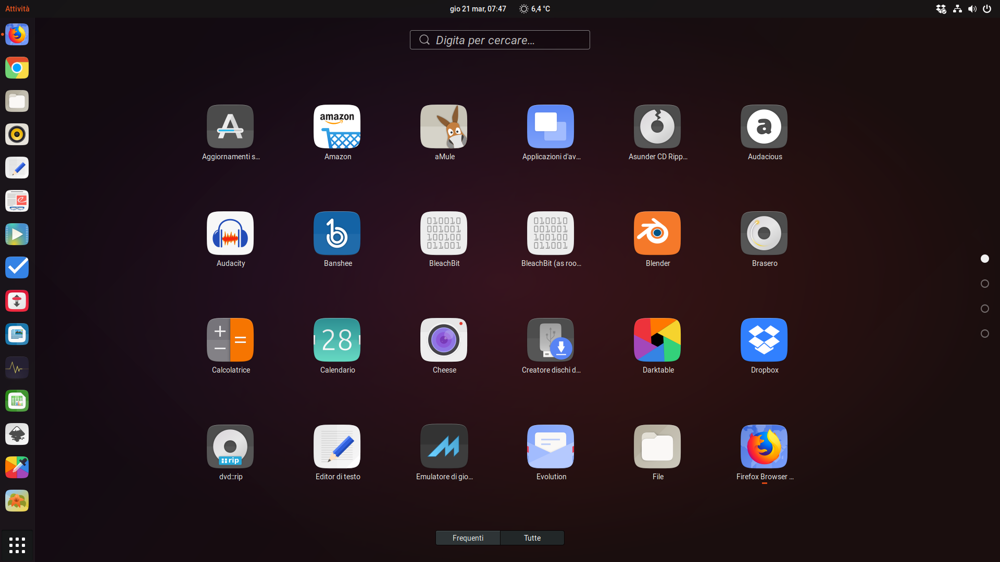
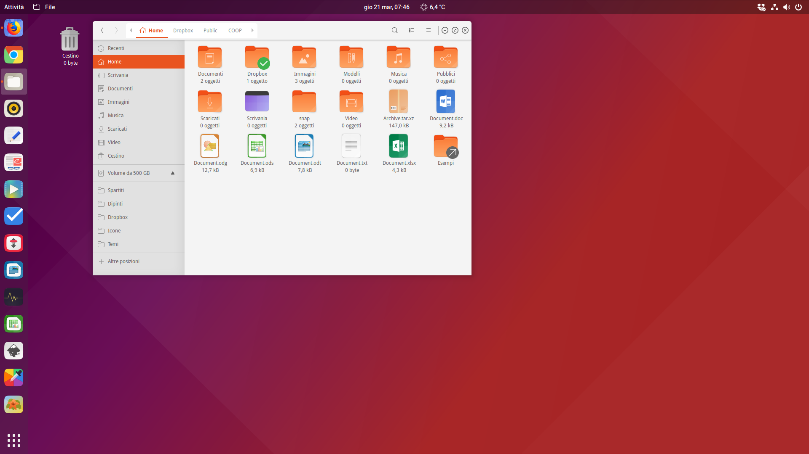
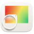

<p align="center"> 

</p>

<p align="center"> 

</p>




<h1>Index</h1>

Or you can visit quickly the [Wiki](https://github.com/Bonandry/suru-plus-ubuntu/wiki).

- [What is new in the version?](#what-is-new-in-the-version)
  - [v17.1](#v171)
  - [v25.0](#v250)
- [Installing with CLI](#installing-with-cli)
  - [ROOT directory (recommended)](#root-directory-recommended)
  - [HOME directory for GTK](#home-directory-for-gtk)
  - [For Lubuntu users](#for-lubuntu-users)
  - [For non-Ubuntu users](#for-non-ubuntu-users)
  - [Uninstall](#uninstall)
- [Changing the alternative icon and the icons colour](#changing-the-alternative-icon-and-the-icons-colour)
  - [Firefox](#firefox)
    - [To change the icon path in the desktop file (recommended)](#to-change-the-icon-path-in-the-desktop-file-recommended)
    - [To create the symlink](#to-create-the-symlink)
  - [Alternative Icon](#alternative-icon)
  - [Alternative Colour](#alternative-colour)
- [Changing the folders colour](#changing-the-folders-colour)
- [Known and unknown bugs](#known-and-unknown-bugs)
  - [Snap-built apps](#snap-built-apps)
  - [AppImage-built apps](#appimage-built-apps)
  - [Hardcoded application icons with ugly name](#hardcoded-application-icons-with-ugly-name)
  - [Unattractive icons of Bluetooth Manager, Gigolo, Network Wifi, etc.](#unattractive-icons-of-bluetooth-manager-gigolo-network-wifi-etc)
  - [Unrecognised and ugly icons (Okular, etc.)](#unrecognised-and-ugly-icons-okular-etc)
  - [Do you support non-GNOME distros?](#do-you-support-non-gnome-distros)
- [Report](#report)
- [Contribution](#contribution)
- [Authors and Contributors](#authors-and-contributors)
  - [Core developers (in order of appearance):](#core-developers-in-order-of-appearance)
  - [Contributors:](#contributors)
- [Changelog](#changelog)
- [Credits and Licences](#credits-and-licences)

## What is new in the version?

### v17.1

Added three alternatives of Firefox that you can choose:

 
 


### v25.0

* Upstreamed from Suru++ 25;
* Several icons have been reimagined with a new GNOME 3.32 look, just click one of them to preview what it is:

 
 
 
 
 
 
 
 
 
 
 
 
 
 
 
 
 

* You have more options to choose one of alternative icons or icons colours you prefer more, for example, the backup icon:
  * Backup
    * Alternative pictograms

      
      
      
      
      

    * Alternative colours

      
      
      
      
      
      
      
      

<br/>

* New folders colours. Check the available colours in the item [Changing the folders colour](#changing-the-folders-colour). 

## Installing with CLI

Use the scripts to install the latest version directly from this repository (independently of your distribution):

**NOTE:** Use the same command to update the icon theme.

### ROOT directory (recommended)

```
wget -qO- https://raw.githubusercontent.com/Bonandry/suru-plus-ubuntu/master/install.sh | sh
```

### HOME directory for GTK

```
wget -qO- https://raw.githubusercontent.com/Bonandry/suru-plus-ubuntu/master/install.sh | env DESTDIR="$HOME/.icons" sh
```

### For Lubuntu users

As you want 24px and 26px icons to be colourful in the panel, please visit [Suru++ Lubuntu](https://github.com/gusbemacbe/suru-plus-lubuntu/). 

### For non-Ubuntu users

This repository is designed only for Ubuntu, from 18.04 to 19.04. If you want the support for non-GNOME and non-Ubuntu, please visit [@gusbemacbe](https://github.com/gusbemacbe)’s [Suru++ 25](https://github.com/gusbemacbe/suru-plus).

### Uninstall

```
wget -qO- https://raw.githubusercontent.com/gusbemacbe/suru-plus-ubuntu/master/install.sh | env uninstall=true sh
```

## Changing the alternative icon and the icons colour

### Firefox

There are two options you can choose:

#### To change the icon path in the desktop file (recommended)

1. Go to `/usr/share/applications/`;
2. Go to the desktop file `Firefox`;
3. Open the file with your favourite text editor;
4. Find `Icon=...` and modify it with one of three alternatives: `Icon=firefox` or `Icon=firefox-20` or `Icon=firefox-mozilla`. Save it.

#### To create the symlink

Run the command:

```
# It depends on where you have installed Suru++ Ubuntu icons theme
cd ~/.icons/Suru++-Ubuntu/apps/scalable`
cd /usr/share/icons/Suru++-Ubuntu/apps/scalable`

# Choose one of your favourite icon:
ln -sfnr firefox-20.svg firefox.svg
ln -sfnr firefox-mozilla.svg firefox.svg
```

To revert to the original, you need to copy the original `firefox.svg` from the folder `alternatives` at the repository, to the folder `Suru++-Ubuntu/apps/scalable`. 

### Alternative Icon

1. Go to the folder `alternatives`
2. Choose one of your favourite icon and copy it to `Suru++-Ubuntu/apps/scalable`.
3. Run the commands:

```
cd ~/.icons/Suru++-Ubuntu/apps/scalable
# for example, create the alternative symlink to the icon without suffix: ln -sfnr backup-alt1.svg backup.svg
ln -sfnr new.svg old.svg
```

To revert to the original, you need to copy the original icon without suffix from the folder `alternatives` at the repository, to the folder `Suru++-Ubuntu/apps/scalable`. 

### Alternative Colour

1. Go to the folder `alternatives`
2. Choose one of your favourite icon colour and copy it to `Suru++-Ubuntu/apps/scalable`.
3. Run the commands:

```
cd ~/.icons/Suru++-Ubuntu/apps/scalable
# for example, create the alternative symlink to the icon without suffix: ln -sfnr backup-azzuro.svg backup.svg
ln -sfnr new.svg old.svg
```

To revert to the original, you need to copy the original icon without suffix from the folder `alternatives` at the repository, to the folder `Suru++-Ubuntu/apps/scalable`. 

## Changing the folders colour

The available colours in Suru++ Ubuntu:


To change the colour of folders, you need to install [Suru++ Folders](https://github.com/gusbemacbe/suru-plus-folders).

## Known and unknown bugs

### Snap-built apps

Unfortunately the snap-built apps are not supported almost by any icons themes, because the icons are hardcoded and the desktop files are not hosted in the folder `~/.local/share/applications` or `/usr/share/applications`.

To solve it, please follow the instructions:

1. Do:

```bash
# Copy all desktop files of all snap-built apps to "~/.local/share/applications"
sudo cp /var/lib/snapd/desktop/applications/*.desktop ~/.local/share/applications
# To make the files publically accessible
sudo chmod -R 777 ~/.local/share/applications
# To remove the duplicates
sudo rm /var/lib/snapd/desktop/applications/*.desktop
```

2. Go to the directory  `~/.local/share/applications`;
3. Open each desktop file of snap app with your favourite text editor and modify the encoded path of `Icon` to the simple path with no extension. For example, if you use Insomnia:

```bash
# Replace...
Icon=snap/icons/icon.png
# for
Icon=insomnia
```

4. Run `update-desktop-database` in the terminal.

### AppImage-built apps

With AppImageLauncher installed, you click an AppImage, it is automatically integrated to `~/Applications`, and desktop files are automatically created into `~/local/share/applications`. But if you modify one of the AppImage-built app desktop file to correct the icon path, AppImageLauncher reverts automatically the desktop file to the original and keeps again the icon path hardcoded. It also removes the option `StartupWMClass`. We recommend you to remove `AppImageLauncher`. 

1. Remove `appimagelauncher` via terminal;
2. Create `~/Applications/AppImages/`, move all AppImages to this folder. Make all AppImages executable and trusted:

```bash
chmod a+x *.AppImage
```

3. Reboot;
4. Create the desktop files manually in the directory `~/.local/share/applications`. Do not forget of adding the option `StartupWNClass` or the icon will be unrecognised or ugly. The desktop file, for example, `ColourPicker.desktop`, should be like:

```
[Desktop Entry]
Categories = Graphics;
Comment = A mininal but complete color picker
Comment[en_GB] = A mininal but complete colour picker
Exec = $HOME/Applications/AppImages/ColorPicker.AppImages
GenericName = Color Picker
GenericName[en_GB] = Colour Picker
Icon = colorpicker
Keywords = colorpicker; color-picker
Keywords[en_GB] = colourpicker; colour-picker
# MimeType = application/illustrator; application/pdf;
Name = Color Picker
Name[en_GB] = Colour Picker
StartupNotify = true
StartupWMClass = ColorPicker
Terminal = false
Type = Application
Version = 1.0
# X-AppImage-Version = 9.0
X-Ayatana-Desktop-Shortcuts = Color Picker
X-GNOME-FullName = Minimal Color Picker
X-GNOME-FullName[en_GB] = Minimal Colour Picker
X-DBUS-ServiceName = ColorPicker
```

And run `update-desktop-database`.

**Tips**

1. To know which `StartupWNClass` name, for example, 
  * See in bold: <b><code>ColorPicker</b>.AppImage</code>;
  * If it does not work, you need to extract the AppImage to figure the `bin` shell name;
  * If it does not work yet, check the title name in the panel when you open the AppImage app. 
2. If you are foreigner and want comment and name in your native language, you can add, for example, `Comment[en_GB]`, `GenericName[en_GB]`, `Keywords[en_GB]`, `Name[en_GB]` and `X-GNOME-FullName[en_GB]`. If to Spanish, it would be `[es]`, and to Spanish from Mexico, `[es_MX]`. 
3. The AppImage names should remain original, but if you want to rename, you are free, but for the `StartupWNClass` name, you need to put the original name of that AppImage as see in the item 1 above.

### Hardcoded application icons with ugly name 

We have already icons, but it is wrong or ugly name, or because the icon is hardcoded. For example, the old version of application GitHub Desktop used `Icon=desktop.png` and other apps, like Insomnia, use `Icon=icon.png`, or worse, `Icon=stupid/path/icon.png`. 

To deal with hardcoded application icons we recommend to install [hardcode-fixer](https://github.com/Foggalong/hardcode-fixer). Suru++ supports most of the applications in the list. If [hardcode-fixer](https://github.com/Foggalong/hardcode-fixer) doesn't support your favourite app yet, please open an [issue here](https://github.com/Foggalong/hardcode-fixer/issues) or edit your .desktop file manually.

### Unattractive icons of Bluetooth Manager, Gigolo, Network Wifi, etc.

Because the desktop files use the 16px icons of `actions`, `mimetypes`, `panel` and `places` and not the icons of `apps` and `categories`. Therefore, you need to change manually the **generic icon names** in the desktop files to catch the icons of `apps`.

### Unrecognised and ugly icons (Okular, etc.)

Not just Suru++ Ubuntu and Suru++ 25, it also affects Antü, Flat Remix, La Capitaine, Numix, Papirus, and Zafiro icons theme. It is a missed `StartupWMClass` option in the desktop files in KDE and an icon cache bug in GNOME and KDE. 

1. Install and use [StartupWMClassFixer](https://github.com/bilelmoussaoui/StartupWMClassFixer) to fix the missed option `StartupWMClass`;
2. Install and use [Stacer](https://github.com/oguzhaninan/Stacer) to clean caches;
3. Log out and log in.

### Do you support non-GNOME distros?

No, I do not. If I will add something else to this icons theme, it will increase bugs, ugliness in KDE and archive size. I would not like to work with fixing the bugs and to have headache. You must consider the alternative icons theme: [@gusbemacbe](https://github.com/gusbemacbe)'s [Suru++ 25](https://github.com/gusbemacbe/suru-plus). 

## Report

Report, but please provide well-detailed information. It is required to write in English or Italian.

Before creating a new issue ensure that:

- The icon request is not a duplicate;
- The title contains application or icon name (for example: `[Icon request] Boostnote`).

**NOTE**

You'll find most of necessary entries for the icon request in a app's desktop file, usually placed in the `/usr/share/applications/` or `~/.local/share/applications` folder (for example: `/usr/share/applications/firefox.desktop`).

- App Name
- Icon Name
- Description
- Webpage (optional)
- Original Icon

Upload (or just drag and drop) the original app icon below.

## Contribution

See the file [CONTRIBUTING.md](CONTRIBUTING.md)

## Authors and Contributors

The FreeDesktop Suru icon set is designed and developed by:

- Sam Hewitt: <sam@snwh.org>

The original Suru icon set and concept was created by:

- Matthieu James
- Canonical Design Team

### Core developers (in order of appearance):

- Andrea Bonanni (original author): <bonandry@gmail.com>
- Gustavo Costa (co-author and collaborator): <gusbemacbe@gmail.com>

### Contributors:

- Chris Escarra: [@ChrisP4](https://github.com/ChrisP4)

## Changelog

Please visit the [release list](https://github.com/Bonandry/suru-plus-ubuntu/releases) to see the changelogs. 

Or see the [full changelog](CHANGELOG.md). 

## Credits and Licences

* CC-BYSA/GPL3 © Suru Icons by Sam Hewitt.
* GPL3 © 2018 Suru++ Ubuntu by Andrea Bonanni and Gustavo Costa. 
