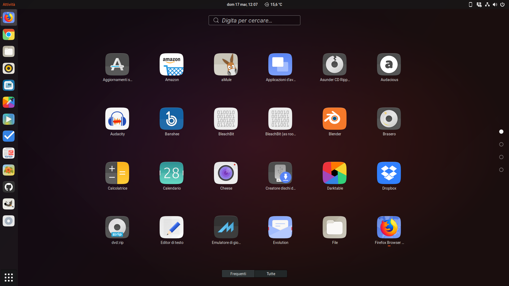


 

<h3 align="center">A third-party Suru icons for Ubuntu 18.04</h3>

<h3 align="center">An elegant, modern and sweet Suru icons based on <a href="https://snwh.org/suru">Suru Icons</a> by Sam Hewitt</h3>

## Installation

### For Lubuntu users

As you want 24px and 26px icons to be colourful in the panel, and want the dark theme, please visit:

* [Suru++ Lubuntu](https://github.com/gusbemacbe/suru-plus-lubuntu/)
* [Suru++ Dark Lubuntu](https://github.com/gusbemacbe/suru-plus-dark-lubuntu/)

## Installation

### With CLI

* [For users of old Ubuntu versions and Ubuntu 16.04](instructions_with_cli1.md)
* [For users of Ubuntu 16.04.4 and above and for Ubuntu 18.04](instructions_with_cli2.md)

### Without CLI

* [For users of old Ubuntu versions and Ubuntu 16.04](instructions_without_cli1.md)
* [For users of Ubuntu 16.04.4 and above and for Ubuntu 18.04](instructions_without_cli2.md)

## Known bugs

### This icon theme do not apply correctly the apps icons

Some apps, as AppImage-built, Snap-built and dpkg-installed apps do not use relative path or relative icon. They use absolute path. Other apps use misleading icon name, for example, GitHub Desktop uses the `Icon=desktop`.  

It is why my collaborator @gusbemacbe provided the [desktop configuration files](https://github.com/gusbemacbe/suru-plus/tree/master/desktop) for you. Put them in `~/.local/share/applications`. 

We recommend you to back the desktop configuration files up when you intend to make a clean install or reinstall your distribution.

### Some icons are not applied correctly and look bad in KDE.

Because of this, I will no longer offer support for KDE due to these bugs. The KDE environment itself do not apply correctly the icons. 

### Do you support for other distributions, as Arch Linux, Linux Mint, etc.?

No, because if I will add everything, it will cause a lot of bugs and increase the file size. I would not like to work with bugs and to have headache. I prefer focusing only on Ubuntu distributions. 

Therefore, you must consider my collaborator's alternative icon theme if you ant this support: [Suru++ [Complete]](https://github.com/gusbemacbe/suru-plus)

## Report

* Do you find the missed icons?
* Do you find the misused icons?
* Did you find the errors?

Report, but please provide well-detailed informations.

## Contribution

* Would you like to improve our repository?
* Do you want to add and request the icons? Make a pull request and we will analyse and approve or not

## Contributors

The contributors is on the file [AUTHORS](AUTHORS)

## Changelog

The changelog is available on the release page in theme's repository.

## License

GPL3 © 2018 Suru++ by Andrea Bonanni and Gustavo Costa. 